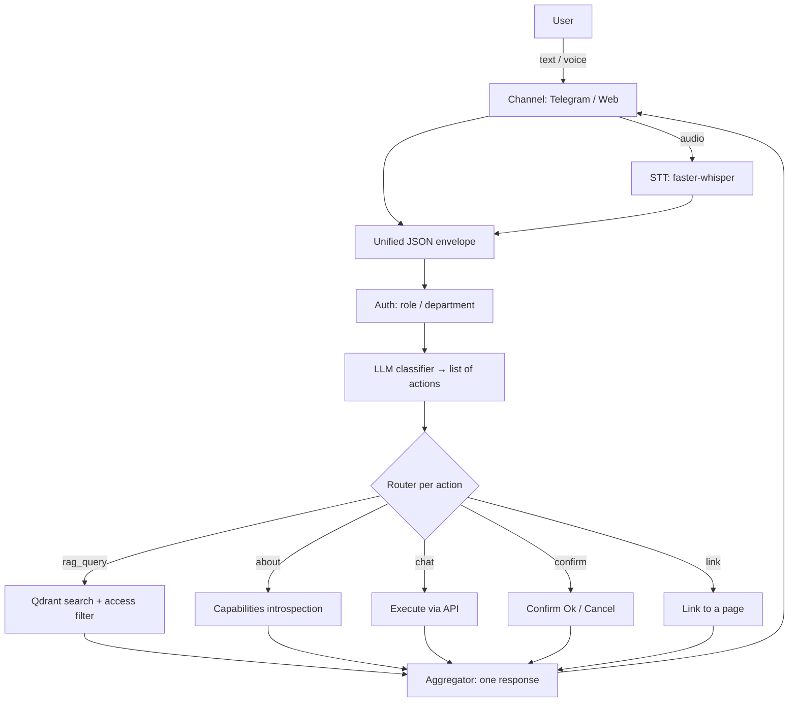

# onbo

*English · [Русский](README.ru.md)*

Open-source onboarding assistant **for any software**. It accepts user requests over any channel (Telegram, web chat, voice), understands them, and either answers from the knowledge base (RAG) or performs a profile action (change language, email, etc.).

- **License:** MIT
- **Language:** Python
- **Status:** 🚧 early but functional — every layer is implemented, not just stubbed. Profile actions really execute over HTTP against your product's API, and a **bundled demo backend** lets you run them end-to-end without one. There's a **visual admin panel** at `/admin`, **seeded demo users**, and a **pytest suite**. Out of the box it uses OpenAI (one `OPENAI_API_KEY` covers chat and embeddings), but every model is swappable — including fully local ones. Classification survives an unreachable LLM (heuristic fallback), and voice **auto-falls back to CPU** if the GPU runtime is missing. RAG / channels / STT still need their optional dependencies and services (Qdrant, Postgres, Redis).

**Step-by-step guides:**
[1 — install & configure](docs/HOWTO-1-setup.md) ·
[2 — knowledge base, commands, chat & voice](docs/HOWTO-2-kb-and-chat.md)

---

## Why

One tool you can attach to any product so it can:

- accept requests over **any channel** and in **any form** — text, form, voice message;
- understand **several requests in a single message** (e.g. by voice: "change my email, language and password") — it applies what it can and honestly reports what it can't;
- answer from a **knowledge base** with access separated by department/role (support can't see accounting docs and vice versa);
- perform **profile actions** with the right level of caution (see modes below);
- **describe itself** using the very same methods it offers to users.

Everything product-specific (channels, actions, data sources) is a **plugin and config**. The core stays untouched.

## How it works



## Action modes

Every action in the registry (`config/actions.yaml`) is handled in one of three modes:

| Mode | When | Behavior |
|---|---|---|
| `chat` | low risk (e.g. change language) | executed immediately via the API |
| `confirm` | needs a check (e.g. change email) | asks with Ok / Cancel buttons, executes only on Ok |
| `link` | sensitive data (password, personal data) | **never executed in chat** — returns a link to the relevant page |

For several sensitive changes at once it returns several links (hence a link rather than a forced redirect).

`chat` and `confirm` actions call your product's HTTP API (`config/settings.yaml → product.base_url`). With no base URL set they run in **dry-run** (validate + report what *would* be called). A bundled demo backend (`onbo demo-backend`) lets you watch them execute for real against in-memory state.

### Audience: department / roles

Actions (and pipelines) take optional `department` and `roles` — the same semantics as the knowledge base: empty means available to everyone, otherwise the action is only offered to users whose profile matches. This drives both routing and the proactive welcome digest.

### Pipelines

A pipeline bundles several actions behind one command — e.g. "place order 42" runs *create internal invoice → create client invoice → send to the client* under a single confirmation:

```yaml
pipelines:
  new_order:
    description: "Place an order: internal + client invoices, then send to the client"
    mode: confirm            # chat | confirm (link is not allowed for a pipeline)
    confirm_prompt: "Place order {order_id} and send the invoices?"
    params: { order_id: { type: string, required: true } }
    roles: [accountant]
    steps:
      - action: create_invoice_internal
        params: { order_id: "{order_id}" }
      - action: create_invoice_client
        params: { order_id: "{order_id}" }
      - action: send_invoice_to_client
        params: { order_id: "{order_id}" }
    on_error: stop           # stop | continue
```

Steps reference existing actions by name; a step may not point at a `link`/sensitive action. The classifier and the self-docs treat a pipeline as one more action name, so one confirmation covers the whole chain. On failure with `on_error: stop` it halts and reports honestly what already ran.

## Knowledge-base access control

Access separation is about security, not just relevance:

- at indexing time every chunk gets visibility tags (`department`, `roles`);
- at query time the filter is built from the **authenticated user's profile**, **not** from the query text and **not** from an LLM decision;
- the filter is applied in Qdrant **before** the LLM — inaccessible chunks never enter the results.

## Knowledge base

- **Documents** (Markdown/PDF/docx/txt, website crawl) — split into chunks, embedded, stored in Qdrant.
- **Q&A pairs** — curated question/answer entries that rank above raw chunks at retrieval.
- The canonical source is **Postgres**; the search index is **Qdrant** (rebuilt from Postgres).
- Access is assigned via **collections** (a set of documents with default permissions).
- A management layer — a **visual admin panel** and API at `/admin` (token-protected via `ONBO_ADMIN_TOKEN`) plus CLI (`onbo kb ...`).

## Voice

Speech recognition (**faster-whisper**) is a shared service available to any channel, not a channel of its own. It's enabled by two flags: `stt.enabled` (global) + the channel's `accept_voice`. It prefers the GPU (`device: cuda`) and **automatically falls back to CPU** if the CUDA runtime is missing, so voice never hard-crashes. Responses are text for now; answer voice-over (TTS) is deferred (extension point `tts/` + flag `tts.enabled`).

## Self-documentation

The tool onboards the user onto itself:

- its own docs (`docs/self/`) are indexed into the public `about` collection — "how do I configure you?" goes through the normal RAG path;
- live capability introspection (`handlers/about.py`) — "what can I do right now" filtered by the user's role (which actions, channels and KB topics they may access).

## Proactive welcome

On a user's first contact the assistant introduces itself, tailored to that user's access: who they are per the system (department/roles), what they can do here (the actions and pipelines they may use, grouped by mode), and what they can ask about (their KB collections with a few example questions). An optional starter video per role/department can be attached (`welcome.video`). Triggers: `POST /welcome` (web), `/start` (Telegram), and automatically on a new user's first message — the greeting precedes their actual answer, it never swallows the question. Controlled by `welcome.enabled` and the `features.welcome` flag.

## Machine-readable manifest (`llm.json`)

`GET /llm.json` (with a `/.well-known/llm.json` alias) publishes a small machine-readable manifest for external LLM agents that read your site: the product name/description, the `/chat` endpoint, the **public** Q&A pairs (empty `department`/`roles` only — private knowledge never leaves), and the available actions and pipelines (name, description, mode, params, plus a `link_url` for link actions — internal `api:` blocks are never exposed). Generate a static file for hosting with `onbo llm-export`.

## Feature flags

The `features:` block in `config/settings.yaml` is a master on/off switch per subsystem — turn one off and its web mount and/or routing path disappears: `chat`, `admin`, `media`, `llm_manifest`, `welcome`, `actions`, `rag`. It lets you run a stripped-down deployment — e.g. **only `llm.json`** (everything off except `llm_manifest`) for a product that just wants a machine-readable manifest, or an **actions-only** assistant (`rag: false`) that never answers free-text questions.

## Stack

LiteLLM (provider-agnostic LLM) · Qdrant (vector DB) · embeddings local via fastembed or hosted via LiteLLM (OpenAI / Gemini / Voyage) · Postgres + Redis (state) · faster-whisper (STT) · FastAPI + aiogram (channels) · Docker Compose.

## Repository layout

```
onbo/
├── core/         # core: pipeline, classifier, router, aggregator, LLM, schemas
├── channels/     # channel plugins: telegram, web (+ future ones)
├── stt/          # shared speech-recognition service
├── handlers/     # rag, about, actions/ (action plugins)
├── rag/          # retrieval: store/qdrant, embeddings, retriever
├── kb/           # knowledge base: models, admin, sources/, chunker, index
├── auth/         # user profile → access filter
├── generator/    # CLI scanner of a target project → draft actions.yaml
├── state/        # Postgres + Redis
├── config/       # actions.yaml, seed_faq.yaml, settings.yaml
└── docs/         # flow.mmd, self/
```

Principle: a new channel or action = **a new file in its own folder** following a single interface; `core/` doesn't change.

## Installation

```bash
pip install -e ".[all]"     # core + all optional dependencies
# or selectively: pip install -e ".[llm,rag,web,telegram,stt]"
```

The core depends only on `pydantic` and `pyyaml`; heavy libraries (LiteLLM, Qdrant, embeddings, faster-whisper, FastAPI, aiogram) live behind extras and are imported lazily.

## CLI

```bash
onbo serve web                              # run the web channel + API
onbo serve telegram                         # run the Telegram bot
onbo kb add-doc ./handbook --collection support --roles support
onbo kb add-qa "How do I reset my password?" "Settings → Security" --collection common
onbo kb reindex                             # rebuild the index from Postgres
onbo kb seed                                # load the starter onboarding FAQ
onbo kb import ./draft_faq.yaml             # import Q&A pairs from a seed-format file
onbo about                                  # index the self-docs
onbo users                                   # seed demo users (roles/departments) into Postgres
onbo demo-backend                            # run the demo product backend on :18100
onbo scan ./target-project                  # draft config/actions.yaml for another project
onbo llm-export --out llm.json              # write the machine-readable manifest for static hosting
```

## Running

The recommended local setup runs the **infrastructure in Docker** and the **app on the host**, so faster-whisper (STT) uses your GPU directly. By default onbo talks to OpenAI — chat `gpt-5.6-terra`, embeddings `text-embedding-3-large` — so `.env` needs one line: `OPENAI_API_KEY=sk-...`.

```bash
cp .env.example .env          # then put your OpenAI key in it
docker compose up -d          # infra only: qdrant + postgres + redis

./run.sh about                # index the self-docs into the `about` collection
./run.sh kb seed              # load the starter FAQ
./run.sh serve web            # run the web channel + API on http://localhost:18000
```

`run.sh` runs `onbo` from a project venv and points the dynamic linker at the CUDA
libraries that ship in the venv, so faster-whisper loads on the GPU. To keep everything
on your own machine instead, set `LLM_MODEL=ollama_chat/llama3.2:3b` +
`LLM_API_BASE=http://localhost:11434` ([Ollama](https://ollama.com)) and
`EMBED_MODEL=intfloat/multilingual-e5-large` in `.env` (see `.env.example`).

The app can also run fully in Docker (CPU-only STT — Docker GPU passthrough needs
`nvidia-container-toolkit`):

```bash
docker compose --profile app up
```

### See profile actions execute for real

```bash
./run.sh users                             # seed demo users into Postgres
./run.sh demo-backend                      # a stand-in product backend on :18100
PRODUCT_API_BASE=http://localhost:18100 ./run.sh serve web
# now "change my language to English" actually mutates the demo backend's state
```

## Tests

```bash
pip install -e ".[dev]"     # adds pytest
pytest                      # hermetic — no GPU, model download, or services needed
```

The suite covers the access filter (proving no cross-department leak), the router's
three action modes, the confirm flow, the HTTP action layer, the admin API, and the
voice plumbing (including the STT CPU fallback and Telegram wiring).

## Claude Code skills

The repository ships [Claude Code](https://claude.com/claude-code) skills under `.claude/skills/` that build the knowledge base and action registry from a target product's source. Each one produces a **draft for review** — never a live change: you edit it (via `/admin` or by hand) before it lands.

- **`/kb-from-code`** — reads the target product's code and writes a draft Q&A base **in the user's language** ("open Settings → Profile…", not "POST /api/…"); the output is a `draft_faq.yaml` you import with `onbo kb import` and refine in `/admin`.
- **`/actions-from-code`** — reads the code and drafts `config/actions.yaml` (the skill version of `onbo scan`); it shows a diff and never overwrites your config without confirmation.
- **`/kb-video`** — records a short walkthrough of a single Q&A flow with Playwright, voices the answer text (ElevenLabs), and attaches the clip to the pair via `video_url`. Requirements: `ffmpeg`, Playwright Chromium, `ELEVENLABS_API_KEY`, and a `refs/voice-ref.wav` voice sample. Without ElevenLabs keys it still records the video and saves the narration text for later (and for other languages).

## Roadmap

The first 12 items are implemented and hardened (profile actions over real HTTP with a demo backend, a visual admin panel, seeded demo users, and a pytest suite). A second wave (13–19) adds Claude Code skills, action pipelines, a machine-readable manifest, feature flags, and a proactive welcome — done.

1. ✅ Core skeleton (schemas, LLM wrapper, pipeline, config, docker-compose).
2. ✅ State: Postgres + Redis.
3. ✅ Classifier + router + aggregator (multi-action).
4. ✅ Action registry + confirmations (chat / confirm / link).
5. ✅ Knowledge base: model, sources, chunker, indexing.
6. ✅ KB management: admin API + CLI + starter seed.
7. ✅ RAG search with the access filter and Q&A priority.
8. ✅ Auth: profile (role/department).
9. ✅ Self-documentation: `docs/self/`, the `about` collection, introspection.
10. ✅ STT + channels (Telegram, Web) with voice input.
11. ✅ Action registry generator.
12. ✅ Flow diagram.
13. ✅ `/kb-from-code` skill + `onbo kb import`.
14. ✅ `/actions-from-code` skill.
15. ✅ Knowledge-base video (`video_url`, `/media`, PATCH, `/kb-video` skill).
16. ✅ Action pipelines.
17. ✅ `llm.json` manifest + `onbo llm-export`.
18. ✅ Feature flags (`features:`).
19. ✅ Proactive welcome (action audience, `/welcome` + `/start`, role videos).

## License

[MIT](LICENSE) — take the code and do whatever you want with it.
