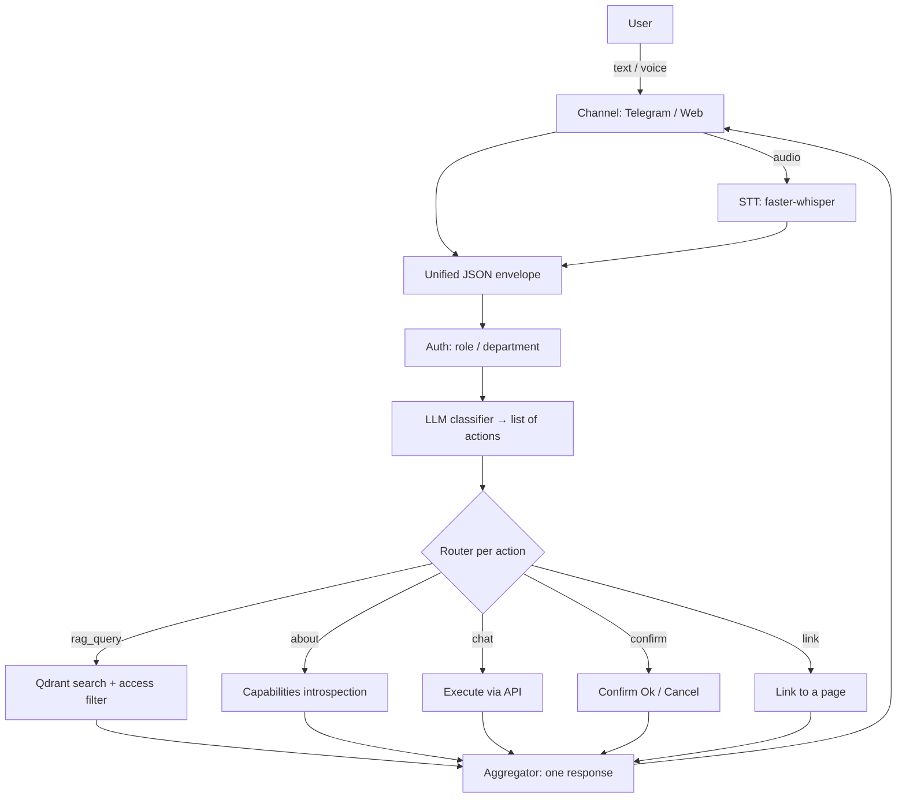

# onbo

*English · [Русский](README.ru.md)*

Open-source onboarding assistant **for any software**. It accepts user requests over any channel (Telegram, web chat, voice), understands them, and either answers from the knowledge base (RAG) or performs a profile action (change language, email, etc.).

- **License:** MIT
- **Language:** Python
- **Status:** 🚧 early stage — the skeleton of every layer is in place (plugin architecture, three action modes, multi-request per message). The package imports and runs, and the pipeline works even without an LLM (heuristic fallback). Action handlers are stubs (awaiting integration with your product's API); RAG / channels / STT need optional dependencies and services (Qdrant, Postgres, Redis).

---

## Why

One tool you can attach to any product so it can:

- accept requests over **any channel** and in **any form** — text, form, voice message;
- understand **several requests in a single message** (e.g. by voice: "change my email, language and password") — it applies what it can and honestly reports what it can't;
- answer from a **knowledge base** with access separated by department/role (support can't see accounting docs and vice versa);
- perform **profile actions** with the right level of caution (see modes below);
- **describe itself** using the very same methods it offers to users.

Everything product-specific (channels, actions, data sources) is a **plugin and config**. The core stays untouched.

## How it works



## Action modes

Every action in the registry (`config/actions.yaml`) is handled in one of three modes:

| Mode | When | Behavior |
|---|---|---|
| `chat` | low risk (e.g. change language) | executed immediately via the API |
| `confirm` | needs a check (e.g. change email) | asks with Ok / Cancel buttons, executes only on Ok |
| `link` | sensitive data (password, personal data) | **never executed in chat** — returns a link to the relevant page |

For several sensitive changes at once it returns several links (hence a link rather than a forced redirect).

## Knowledge-base access control

Access separation is about security, not just relevance:

- at indexing time every chunk gets visibility tags (`department`, `roles`);
- at query time the filter is built from the **authenticated user's profile**, **not** from the query text and **not** from an LLM decision;
- the filter is applied in Qdrant **before** the LLM — inaccessible chunks never enter the results.

## Knowledge base

- **Documents** (Markdown/PDF/docx/txt, website crawl) — split into chunks, embedded, stored in Qdrant.
- **Q&A pairs** — curated question/answer entries that rank above raw chunks at retrieval.
- The canonical source is **Postgres**; the search index is **Qdrant** (rebuilt from Postgres).
- Access is assigned via **collections** (a set of documents with default permissions).
- A minimal management layer — admin API (`/admin`) and CLI (`onbo kb ...`).

## Voice

Speech recognition (**faster-whisper**) is a shared service available to any channel, not a channel of its own. It's enabled by two flags: `stt.enabled` (global) + the channel's `accept_voice`. Responses are text for now; answer voice-over (TTS) is deferred (extension point `tts/` + flag `tts.enabled`).

## Self-documentation

The tool onboards the user onto itself:

- its own docs (`docs/self/`) are indexed into the public `about` collection — "how do I configure you?" goes through the normal RAG path;
- live capability introspection (`handlers/about.py`) — "what can I do right now" filtered by the user's role (which actions, channels and KB topics they may access).

## Stack

LiteLLM (provider-agnostic LLM) · Qdrant (vector DB) · bge-m3 / e5 (embeddings) · Postgres + Redis (state) · faster-whisper (STT) · FastAPI + aiogram (channels) · Docker Compose.

## Repository layout

```
onbo/
├── core/         # core: pipeline, classifier, router, aggregator, LLM, schemas
├── channels/     # channel plugins: telegram, web (+ future ones)
├── stt/          # shared speech-recognition service
├── handlers/     # rag, about, actions/ (action plugins)
├── rag/          # retrieval: store/qdrant, embeddings, retriever
├── kb/           # knowledge base: models, admin, sources/, chunker, index
├── auth/         # user profile → access filter
├── generator/    # CLI scanner of a target project → draft actions.yaml
├── state/        # Postgres + Redis
├── config/       # actions.yaml, seed_faq.yaml, settings.yaml
└── docs/         # flow.mmd, self/
```

Principle: a new channel or action = **a new file in its own folder** following a single interface; `core/` doesn't change.

## Installation

```bash
pip install -e ".[all]"     # core + all optional dependencies
# or selectively: pip install -e ".[llm,rag,web,telegram,stt]"
```

The core depends only on `pydantic` and `pyyaml`; heavy libraries (LiteLLM, Qdrant, embeddings, faster-whisper, FastAPI, aiogram) live behind extras and are imported lazily.

## CLI

```bash
onbo serve web                              # run the web channel + API
onbo serve telegram                         # run the Telegram bot
onbo kb add-doc ./handbook --collection support --roles support
onbo kb add-qa "How do I reset my password?" "Settings → Security" --collection common
onbo kb reindex                             # rebuild the index from Postgres
onbo kb seed                                # load the starter onboarding FAQ
onbo about                                  # index the self-docs
onbo scan ./target-project                  # draft config/actions.yaml for another project
```

## Running

```bash
cp .env.example .env    # fill in keys and DSNs
docker compose up       # app + postgres + qdrant + redis
```

## Roadmap

The skeleton of all 12 items is in place; next is hardening to production quality (wiring handlers to real APIs, tests, a full admin panel).

1. ✅ Core skeleton (schemas, LLM wrapper, pipeline, config, docker-compose).
2. ✅ State: Postgres + Redis.
3. ✅ Classifier + router + aggregator (multi-action).
4. ✅ Action registry + confirmations (chat / confirm / link).
5. ✅ Knowledge base: model, sources, chunker, indexing.
6. ✅ KB management: admin API + CLI + starter seed.
7. ✅ RAG search with the access filter and Q&A priority.
8. ✅ Auth: profile (role/department).
9. ✅ Self-documentation: `docs/self/`, the `about` collection, introspection.
10. ✅ STT + channels (Telegram, Web) with voice input.
11. ✅ Action registry generator.
12. ✅ Flow diagram.

## License

[MIT](LICENSE) — take the code and do whatever you want with it.
