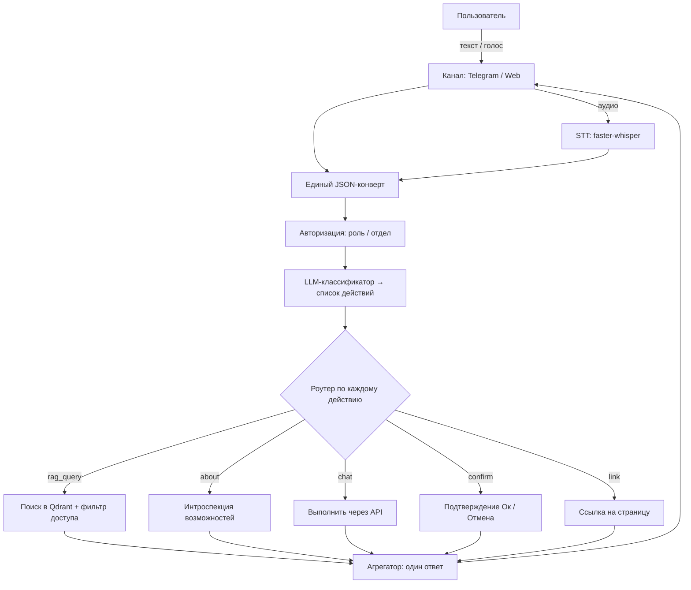

# onbo

*[English](README.md) · Русский*

Опенсорс-ассистент онбординга **под любой софт**. Принимает обращения пользователя любым каналом (Telegram, веб-чат, голос), понимает их и либо отвечает по базе знаний (RAG), либо выполняет действие над профилем (сменить язык, email и т.д.).

- **Лицензия:** MIT
- **Язык:** Python
- **Статус:** 🚧 ранняя стадия — каркас всех слоёв готов (плагинная архитектура, три режима действий, мультизапрос в одном обращении). Пакет импортируется и запускается, конвейер работает даже без LLM (эвристический fallback). Обработчики действий — заглушки (ждут интеграции с API вашего продукта); для RAG/каналов/STT нужны опциональные зависимости и сервисы (Qdrant, Postgres, Redis).

---

## Зачем это

Один инструмент, который можно повесить на любой продукт, чтобы он:

- принимал запросы **любым каналом** и в **любой форме** — текст, форма, голосовое сообщение;
- понимал **несколько запросов в одном обращении** (напр. голосом: «поменяй почту, язык и пароль») — выполнимое применяет, про невыполнимое честно говорит;
- отвечал по **базе знаний** с разделением доступа по отделу/роли (бухгалтерия не видит доки поддержки и наоборот);
- выполнял **действия над профилем** с правильной степенью осторожности (см. режимы ниже);
- **рассказывал о себе** теми же методами, что предлагает пользователям.

Всё, что зависит от конкретного продукта (каналы, действия, источники данных), — это **плагины и конфиг**. Ядро не трогается.

## Как это работает



## Режимы действий

Каждое действие в реестре (`config/actions.yaml`) обрабатывается в одном из трёх режимов:

| Режим | Когда | Поведение |
|---|---|---|
| `chat` | низкий риск (напр. сменить язык) | выполняется сразу через API |
| `confirm` | нужна проверка (напр. сменить email) | переспрашивает кнопками «Ок / Отмена», выполняет только по «Ок» |
| `link` | чувствительные данные (пароль, перс. данные) | **не выполняется в чате** — отдаёт ссылку на нужную страницу |

Для нескольких чувствительных изменений сразу выдаётся несколько ссылок (поэтому ссылка, а не принудительный редирект).

## Контроль доступа в базе знаний

Разграничение доступа — не только про релевантность, а про безопасность:

- при индексации каждый кусок текста получает метки видимости (`department`, `roles`);
- при запросе фильтр берётся из **профиля авторизованного пользователя**, а **не** из текста запроса и **не** из решения LLM;
- фильтр применяется в Qdrant **до** LLM — недоступные фрагменты вообще не попадают в выдачу.

## База знаний

- **Документы** (Markdown/PDF/docx/txt, обход сайта) — рубятся на куски, эмбеддятся, идут в Qdrant.
- **Q&A-пары** — курируемые «вопрос-ответ», при поиске приоритетнее сырых чанков.
- Канонический источник — **Postgres**, поисковый индекс — **Qdrant** (перестраивается из Postgres).
- Доступ назначается через **коллекции** (набор документов с дефолтными правами).
- Минимальный слой управления — админ-API (`/admin`) и CLI (`onbo kb ...`).

## Голос

Распознавание речи (**faster-whisper**) — общий сервис, доступный любому каналу, а не отдельный канал. Включается флагами `stt.enabled` (глобально) + `accept_voice` у канала. Ответ пока текстовый; озвучка ответов (TTS) — на будущее (точка расширения `tts/` + флаг `tts.enabled`).

## Самодокументация

Инструмент онбордит пользователя на самого себя:

- свои доки (`docs/self/`) индексируются в публичную коллекцию `about` — вопрос «как тебя настроить?» идёт обычным RAG-путём;
- живая интроспекция возможностей (`handlers/about.py`) — «что я умею именно сейчас» с учётом роли пользователя (какие действия, каналы, темы КБ ему доступны).

## Стек

LiteLLM (провайдер-агностик к LLM) · Qdrant (векторная БД) · bge-m3 / e5 (эмбеддинги) · Postgres + Redis (состояние) · faster-whisper (STT) · FastAPI + aiogram (каналы) · Docker Compose.

## Структура репозитория

```
onbo/
├── core/         # ядро: pipeline, классификатор, роутер, агрегатор, LLM, схемы
├── channels/     # плагины-каналы: telegram, web (+ будущие)
├── stt/          # общий сервис распознавания речи
├── handlers/     # rag, about, actions/ (плагины-действия)
├── rag/          # retrieval: store/qdrant, embeddings, retriever
├── kb/           # база знаний: модели, admin, sources/, chunker, index
├── auth/         # профиль пользователя → фильтр доступа
├── generator/    # CLI-сканер чужого проекта → черновик actions.yaml
├── state/        # Postgres + Redis
├── config/       # actions.yaml, seed_faq.yaml, settings.yaml
└── docs/         # flow.mmd, self/
```

Принцип: новый канал или действие = **новый файл в своей папке** по единому интерфейсу; `core/` не меняется.

## Установка

```bash
pip install -e ".[all]"     # ядро + все опциональные зависимости
# или точечно: pip install -e ".[llm,rag,web,telegram,stt]"
```

Ядро зависит только от `pydantic` и `pyyaml`; тяжёлые библиотеки (LiteLLM, Qdrant, эмбеддинги, faster-whisper, FastAPI, aiogram) вынесены в extras и импортируются лениво.

## CLI

```bash
onbo serve web                              # запустить веб-канал + API
onbo serve telegram                         # запустить Telegram-бота
onbo kb add-doc ./handbook --collection support --roles support
onbo kb add-qa "Как сбросить пароль?" "Настройки → Безопасность" --collection common
onbo kb reindex                             # перестроить индекс из Postgres
onbo kb seed                                # засеять стартовый онбординг-FAQ
onbo about                                  # проиндексировать доки о себе
onbo scan ./target-project                  # черновик config/actions.yaml для чужого проекта
```

## Запуск

```bash
cp .env.example .env    # заполнить ключи и DSN
docker compose up       # app + postgres + qdrant + redis
```

## Дорожная карта

Каркас всех 12 пунктов готов; далее — доведение до продакшн-качества (интеграция обработчиков с реальными API, тесты, полноценная админка).

1. ✅ Каркас ядра (схемы, LLM-обёртка, pipeline, конфиг, docker-compose).
2. ✅ Состояние: Postgres + Redis.
3. ✅ Классификатор + роутер + агрегатор (multi-action).
4. ✅ Реестр действий + подтверждения (chat / confirm / link).
5. ✅ База знаний: модель, источники, chunker, индексация.
6. ✅ Управление КБ: админ-API + CLI + стартовый сид.
7. ✅ RAG-поиск с фильтром доступа и приоритетом Q&A.
8. ✅ Авторизация: профиль (роль/отдел).
9. ✅ Самодокументация: `docs/self/`, коллекция `about`, интроспекция.
10. ✅ STT + каналы (Telegram, Web) с приёмом голоса.
11. ✅ Генератор реестра действий.
12. ✅ Диаграмма потока.

## Лицензия

[MIT](LICENSE) — берите код и делайте с ним что угодно.
