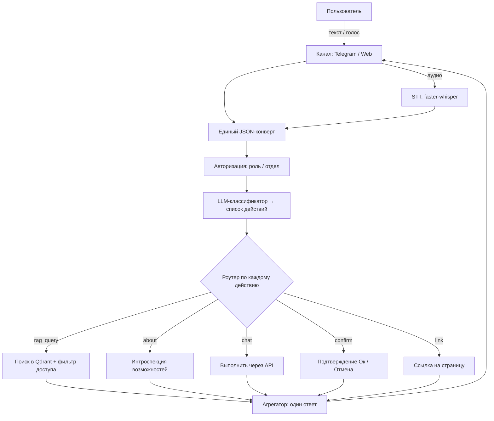

# onbo

*[English](README.md) · Русский*

Опенсорс-ассистент онбординга **под любой софт**. Принимает обращения пользователя любым каналом (Telegram, веб-чат, голос), понимает их и либо отвечает по базе знаний (RAG), либо выполняет действие над профилем (сменить язык, email и т.д.).

- **Лицензия:** MIT
- **Язык:** Python
- **Статус:** 🚧 ранняя, но рабочая стадия — каждый слой реализован, а не просто заглушка. Действия над профилем реально выполняются по HTTP через API вашего продукта, а **встроенный демо-бэкенд** даёт прогнать их end-to-end без него. Есть **визуальная админка** на `/admin`, **посеянные демо-пользователи** и **набор тестов (pytest)**. Из коробки используется OpenAI (один `OPENAI_API_KEY` покрывает и чат, и эмбеддинги), но любая модель заменяема — вплоть до полностью локальных. Классификация переживает недоступную LLM (эвристический fallback), а голос **автоматически откатывается на CPU**, если нет GPU-рантайма. Для RAG/каналов/STT по-прежнему нужны опциональные зависимости и сервисы (Qdrant, Postgres, Redis).

**Пошаговые руководства:**
[1 — запуск и настройка](docs/HOWTO-1-setup.ru.md) ·
[2 — база знаний, команды, чат и голос](docs/HOWTO-2-kb-and-chat.ru.md)

---

## Зачем это

Один инструмент, который можно повесить на любой продукт, чтобы он:

- принимал запросы **любым каналом** и в **любой форме** — текст, форма, голосовое сообщение;
- понимал **несколько запросов в одном обращении** (напр. голосом: «поменяй почту, язык и пароль») — выполнимое применяет, про невыполнимое честно говорит;
- отвечал по **базе знаний** с разделением доступа по отделу/роли (бухгалтерия не видит доки поддержки и наоборот);
- выполнял **действия над профилем** с правильной степенью осторожности (см. режимы ниже);
- **рассказывал о себе** теми же методами, что предлагает пользователям.

Всё, что зависит от конкретного продукта (каналы, действия, источники данных), — это **плагины и конфиг**. Ядро не трогается.

## Как это работает



## Режимы действий

Каждое действие в реестре (`config/actions.yaml`) обрабатывается в одном из трёх режимов:

| Режим | Когда | Поведение |
|---|---|---|
| `chat` | низкий риск (напр. сменить язык) | выполняется сразу через API |
| `confirm` | нужна проверка (напр. сменить email) | переспрашивает кнопками «Ок / Отмена», выполняет только по «Ок» |
| `link` | чувствительные данные (пароль, перс. данные) | **не выполняется в чате** — отдаёт ссылку на нужную страницу |

Для нескольких чувствительных изменений сразу выдаётся несколько ссылок (поэтому ссылка, а не принудительный редирект).

Действия `chat` и `confirm` вызывают HTTP-API вашего продукта (`config/settings.yaml → product.base_url`). Если базовый URL не задан — работают в режиме **dry-run** (валидация + отчёт, что *было бы* вызвано). Встроенный демо-бэкенд (`onbo demo-backend`) даёт посмотреть, как они реально выполняются над in-memory состоянием.

### Аудитория: отдел / роли

У действий (и пайплайнов) есть опциональные `department` и `roles` — семантика та же, что у базы знаний: пусто = доступно всем, иначе действие предлагается только пользователям с подходящим профилем. Это влияет и на роутинг, и на проактивный welcome-дайджест.

### Пайплайны

Пайплайн — это набор действий под одной командой: например, «оформи заказ 42» запускает *накладную себе → накладную клиенту → отправку клиенту* с одним подтверждением на всё:

```yaml
pipelines:
  new_order:
    description: "Оформить заказ: накладные себе и клиенту, отправка клиенту"
    mode: confirm            # chat | confirm (link для пайплайна запрещён)
    confirm_prompt: "Оформить заказ {order_id} и отправить накладные?"
    params: { order_id: { type: string, required: true } }
    roles: [accountant]
    steps:
      - action: create_invoice_internal
        params: { order_id: "{order_id}" }
      - action: create_invoice_client
        params: { order_id: "{order_id}" }
      - action: send_invoice_to_client
        params: { order_id: "{order_id}" }
    on_error: stop           # stop | continue
```

Шаги ссылаются на существующие действия по имени; шаг не может указывать на `link`/чувствительное действие. Классификатор и самодокументация видят пайплайн как ещё одно имя действия, поэтому одно подтверждение покрывает всю цепочку. При ошибке с `on_error: stop` он останавливается и честно перечисляет, что уже успело выполниться.

## Контроль доступа в базе знаний

Разграничение доступа — не только про релевантность, а про безопасность:

- при индексации каждый кусок текста получает метки видимости (`department`, `roles`);
- при запросе фильтр берётся из **профиля авторизованного пользователя**, а **не** из текста запроса и **не** из решения LLM;
- фильтр применяется в Qdrant **до** LLM — недоступные фрагменты вообще не попадают в выдачу.

## База знаний

- **Документы** (Markdown/PDF/docx/txt, обход сайта) — рубятся на куски, эмбеддятся, идут в Qdrant.
- **Q&A-пары** — курируемые «вопрос-ответ», при поиске приоритетнее сырых чанков.
- Канонический источник — **Postgres**, поисковый индекс — **Qdrant** (перестраивается из Postgres).
- Доступ назначается через **коллекции** (набор документов с дефолтными правами).
- Слой управления — **визуальная админка** и API на `/admin` (защищено токеном `ONBO_ADMIN_TOKEN`) плюс CLI (`onbo kb ...`).

## Голос

Распознавание речи (**faster-whisper**) — общий сервис, доступный любому каналу, а не отдельный канал. Включается флагами `stt.enabled` (глобально) + `accept_voice` у канала. Предпочитает GPU (`device: cuda`) и **автоматически откатывается на CPU**, если CUDA-рантайм недоступен, — так голос никогда не падает с ошибкой. Ответ пока текстовый; озвучка ответов (TTS) — на будущее (точка расширения `tts/` + флаг `tts.enabled`).

## Самодокументация

Инструмент онбордит пользователя на самого себя:

- свои доки (`docs/self/`) индексируются в публичную коллекцию `about` — вопрос «как тебя настроить?» идёт обычным RAG-путём;
- живая интроспекция возможностей (`handlers/about.py`) — «что я умею именно сейчас» с учётом роли пользователя (какие действия, каналы, темы КБ ему доступны).

## Стартовая презентация (welcome)

При первом контакте ассистент сам представляется — с учётом доступа пользователя: кто он по данным системы (отдел/роли), что здесь может сделать (доступные ему действия и пайплайны, сгруппированные по режиму) и о чём можно спросить (его коллекции КБ + несколько примеров вопросов). Опционально прикрепляется стартовый ролик на роль/отдел (`welcome.video`). Триггеры: `POST /welcome` (веб), `/start` (Telegram) и автоматически на первом сообщении нового пользователя — приветствие идёт перед его настоящим ответом, а не вместо вопроса. Управляется `welcome.enabled` и флагом `features.welcome`.

## Машиночитаемый манифест (`llm.json`)

`GET /llm.json` (с алиасом `/.well-known/llm.json`) отдаёт компактный машиночитаемый манифест для внешних LLM-агентов, читающих ваш сайт: имя/описание продукта, эндпоинт `/chat`, **только публичные** Q&A-пары (пустые `department`/`roles` — приватные знания наружу не идут) и доступные действия и пайплайны (name, description, mode, params, плюс `link_url` для link-действий — внутренние `api:`-блоки не раскрываются). Статический файл для хостинга генерируется командой `onbo llm-export`.

## Фичефлаги

Блок `features:` в `config/settings.yaml` — мастер-переключатель для каждой подсистемы: отключаешь флаг, и её веб-маунт и/или путь роутинга исчезают: `chat`, `admin`, `media`, `llm_manifest`, `welcome`, `actions`, `rag`. Так можно развернуть урезанный вариант — например, **только `llm.json`** (всё выключено, кроме `llm_manifest`) для продукта, которому нужен лишь машиночитаемый манифест, или ассистента **только с действиями** (`rag: false`), который не отвечает на свободные вопросы.

## Стек

LiteLLM (провайдер-агностик к LLM) · Qdrant (векторная БД) · эмбеддинги локально через fastembed или облачные через LiteLLM (OpenAI / Gemini / Voyage) · Postgres + Redis (состояние) · faster-whisper (STT) · FastAPI + aiogram (каналы) · Docker Compose.

## Структура репозитория

```
onbo/
├── core/         # ядро: pipeline, классификатор, роутер, агрегатор, LLM, схемы
├── channels/     # плагины-каналы: telegram, web (+ будущие)
├── stt/          # общий сервис распознавания речи
├── handlers/     # rag, about, actions/ (плагины-действия)
├── rag/          # retrieval: store/qdrant, embeddings, retriever
├── kb/           # база знаний: модели, admin, sources/, chunker, index
├── auth/         # профиль пользователя → фильтр доступа
├── generator/    # CLI-сканер чужого проекта → черновик actions.yaml
├── state/        # Postgres + Redis
├── config/       # actions.yaml, seed_faq.yaml, settings.yaml
└── docs/         # flow.mmd, self/
```

Принцип: новый канал или действие = **новый файл в своей папке** по единому интерфейсу; `core/` не меняется.

## Установка

```bash
pip install -e ".[all]"     # ядро + все опциональные зависимости
# или точечно: pip install -e ".[llm,rag,web,telegram,stt]"
```

Ядро зависит только от `pydantic` и `pyyaml`; тяжёлые библиотеки (LiteLLM, Qdrant, эмбеддинги, faster-whisper, FastAPI, aiogram) вынесены в extras и импортируются лениво.

## CLI

```bash
onbo serve web                              # запустить веб-канал + API
onbo serve telegram                         # запустить Telegram-бота
onbo kb add-doc ./handbook --collection support --roles support
onbo kb add-qa "Как сбросить пароль?" "Настройки → Безопасность" --collection common
onbo kb reindex                             # перестроить индекс из Postgres
onbo kb seed                                # засеять стартовый онбординг-FAQ
onbo kb import ./draft_faq.yaml             # импортировать Q&A-пары из файла формата seed
onbo about                                  # проиндексировать доки о себе
onbo users                                   # засеять демо-пользователей (роли/отделы) в Postgres
onbo demo-backend                            # запустить демо-бэкенд продукта на :18100
onbo scan ./target-project                  # черновик config/actions.yaml для чужого проекта
onbo llm-export --out llm.json              # записать машиночитаемый манифест для статического хостинга
```

## Запуск

Рекомендуемый локальный вариант: **инфраструктура в Docker**, а **приложение на хосте** — так faster-whisper (STT) использует вашу GPU напрямую. По умолчанию onbo ходит в OpenAI — чат `gpt-5.6-terra`, эмбеддинги `text-embedding-3-large`, — поэтому в `.env` нужна одна строка: `OPENAI_API_KEY=sk-...`.

```bash
cp .env.example .env          # и вписать свой ключ OpenAI
docker compose up -d          # только инфра: qdrant + postgres + redis

./run.sh about                # проиндексировать доки о себе в коллекцию `about`
./run.sh kb seed              # засеять стартовый FAQ
./run.sh serve web            # веб-канал + API на http://localhost:18000
```

`run.sh` запускает `onbo` из venv проекта и указывает динамическому линкеру на CUDA-библиотеки,
которые едут внутри venv, — так faster-whisper грузится на GPU. Чтобы всё оставалось на вашей
машине, задайте в `.env` `LLM_MODEL=ollama_chat/llama3.2:3b` +
`LLM_API_BASE=http://localhost:11434` ([Ollama](https://ollama.com)) и
`EMBED_MODEL=intfloat/multilingual-e5-large` (см. `.env.example`).

Приложение можно запустить и целиком в Docker (STT только на CPU — для GPU в контейнере нужен
`nvidia-container-toolkit`):

```bash
docker compose --profile app up
```

### Посмотреть, как действия выполняются по-настоящему

```bash
./run.sh users                             # засеять демо-пользователей в Postgres
./run.sh demo-backend                      # бэкенд-заглушка продукта на :18100
PRODUCT_API_BASE=http://localhost:18100 ./run.sh serve web
# теперь «поменяй язык на английский» реально меняет состояние демо-бэкенда
```

## Тесты

```bash
pip install -e ".[dev]"     # добавляет pytest
pytest                      # герметичны — не нужны ни GPU, ни скачивание моделей, ни сервисы
```

Набор покрывает фильтр доступа (доказывает отсутствие утечки между отделами), три режима
действий в роутере, поток подтверждения, слой HTTP-действий, админ-API и голосовую обвязку
(включая откат STT на CPU и проводку Telegram).

## Скиллы Claude Code

В репозитории есть скиллы [Claude Code](https://claude.com/claude-code) в `.claude/skills/`, которые собирают базу знаний и реестр действий из кода целевого продукта. Каждый выдаёт **черновик под ревью** — не живое изменение: перед применением его правят (через `/admin` или руками).

- **`/kb-from-code`** — читает код целевого продукта и пишет черновик Q&A-базы **на языке пользователя** («откройте Настройки → Профиль…», не «POST /api/…»); на выходе — `draft_faq.yaml`, который импортируют через `onbo kb import` и правят в `/admin`.
- **`/actions-from-code`** — читает код и генерирует черновик `config/actions.yaml` (скилл-версия `onbo scan`); показывает diff и не перезаписывает ваш конфиг без подтверждения.
- **`/kb-video`** — записывает короткий ролик одного Q&A-флоу через Playwright, озвучивает текст ответа (ElevenLabs) и прикрепляет клип к паре через `video_url`. Требования: `ffmpeg`, Playwright Chromium, `ELEVENLABS_API_KEY` и образец голоса `refs/voice-ref.wav`. Без ключей ElevenLabs скилл всё равно записывает видео и сохраняет тексты для озвучки на будущее (и для других языков).

## Дорожная карта

Первые 12 пунктов реализованы и доведены (действия над профилем по реальному HTTP с демо-бэкендом, визуальная админка, посеянные демо-пользователи и набор тестов pytest). Вторая волна (13–19) добавляет скиллы Claude Code, пайплайны действий, машиночитаемый манифест, фичефлаги и проактивный welcome — готово.

1. ✅ Каркас ядра (схемы, LLM-обёртка, pipeline, конфиг, docker-compose).
2. ✅ Состояние: Postgres + Redis.
3. ✅ Классификатор + роутер + агрегатор (multi-action).
4. ✅ Реестр действий + подтверждения (chat / confirm / link).
5. ✅ База знаний: модель, источники, chunker, индексация.
6. ✅ Управление КБ: админ-API + CLI + стартовый сид.
7. ✅ RAG-поиск с фильтром доступа и приоритетом Q&A.
8. ✅ Авторизация: профиль (роль/отдел).
9. ✅ Самодокументация: `docs/self/`, коллекция `about`, интроспекция.
10. ✅ STT + каналы (Telegram, Web) с приёмом голоса.
11. ✅ Генератор реестра действий.
12. ✅ Диаграмма потока.
13. ✅ Скилл `/kb-from-code` + `onbo kb import`.
14. ✅ Скилл `/actions-from-code`.
15. ✅ Видео в базе знаний (`video_url`, `/media`, PATCH, скилл `/kb-video`).
16. ✅ Пайплайны действий.
17. ✅ Манифест `llm.json` + `onbo llm-export`.
18. ✅ Фичефлаги (`features:`).
19. ✅ Проактивный welcome (аудитория действий, `/welcome` + `/start`, ролики ролей).

## Лицензия

[MIT](LICENSE) — берите код и делайте с ним что угодно.
